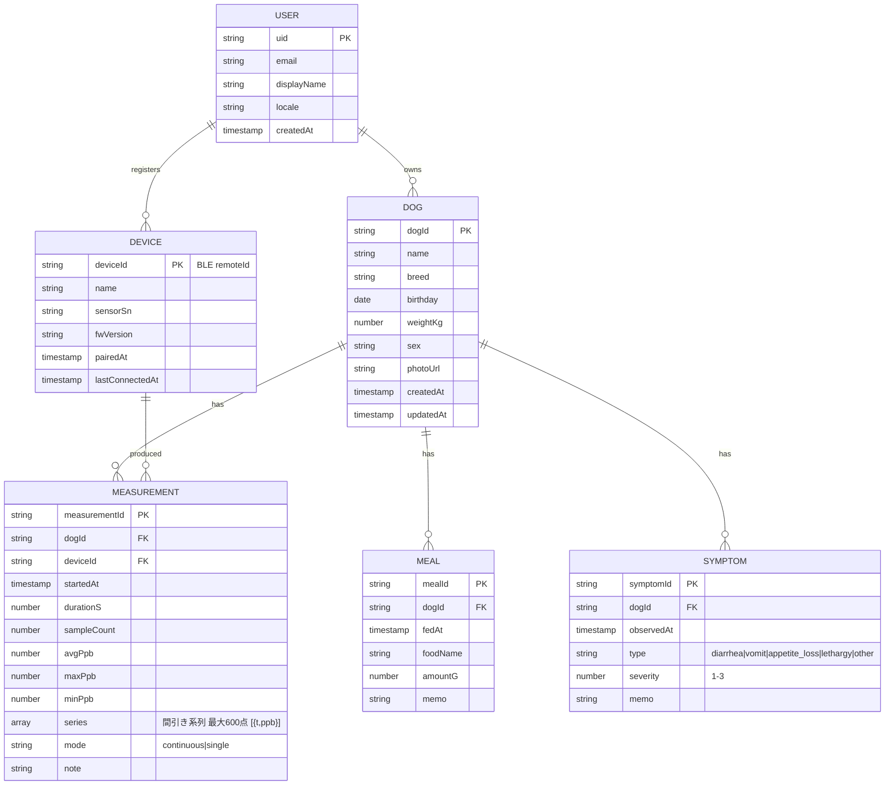

# ⑦ データベース設計 (Cloud Firestore)

## ER図



## コレクションパス

```
users/{uid}                                  … USER
users/{uid}/dogs/{dogId}                     … DOG
users/{uid}/dogs/{dogId}/measurements/{id}   … MEASUREMENT
users/{uid}/dogs/{dogId}/meals/{id}          … MEAL
users/{uid}/dogs/{dogId}/symptoms/{id}       … SYMPTOM
users/{uid}/devices/{deviceId}               … DEVICE
users/{uid}/dogs/{dogId}/dailyStats/{yyyy-mm-dd}  … Functions生成の日次集計
```

## 設計理由
- サブコレクション分離により**ルールがuid一本で完結**、リストクエリも自然。
- `series` は最大600点(1点≈16B→約10KB)で1MB制限に余裕。生波形はアプリ表示用途のみ。
- 履歴一覧は `measurements` を `startedAt desc` + `limit` でページング(複合インデックス定義済み)。
- Meal/Symptomは測定と時間相関で突き合わせるため独立コレクション(JOINはアプリ側)。
